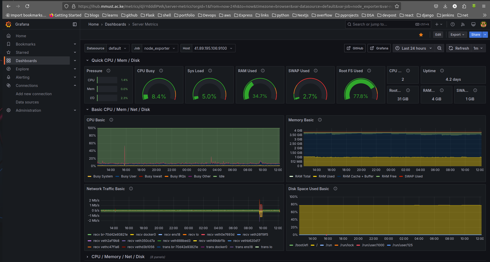
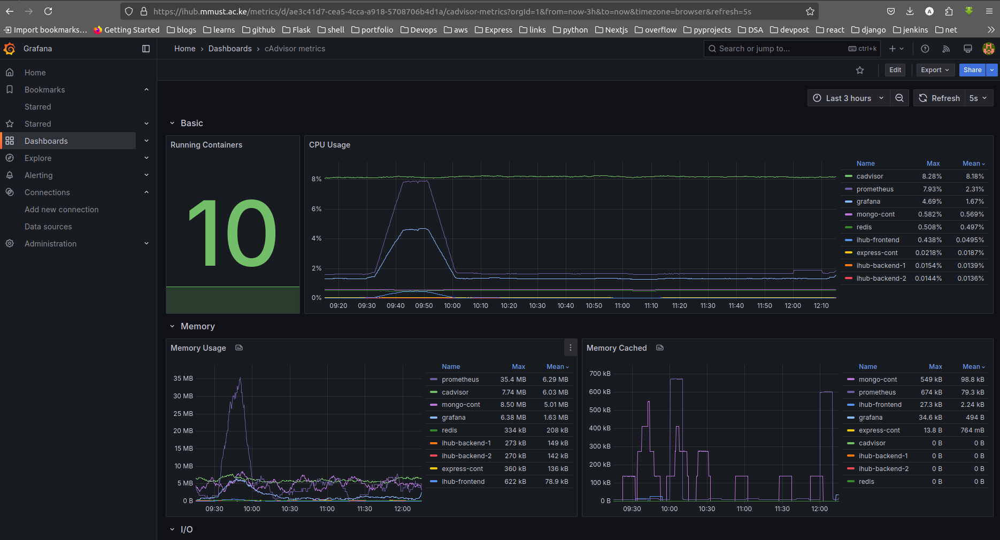

# Ihub
The mmust ihub responsive web application

## 🔥️Monitoring🔥️
To ensure high availability, performance, and quick issue detection for the MMUST IHUB website, we have implemented a robust full-stack monitoring solution. We have deployed Prometheus for collecting time-series metrics, cAdvisor to monitor container-level resource usage such as CPU, memory, and disk I/O and Grafana for providing real-time dashboards and insights into the system's health and performance. This setup enables proactive monitoring, immediate anomaly detection, and provides a strong foundation for future scaling and maintenance of the MMUST IHUB platform.

> #### Server metrics
>> 

> #### Container metrics
>> 